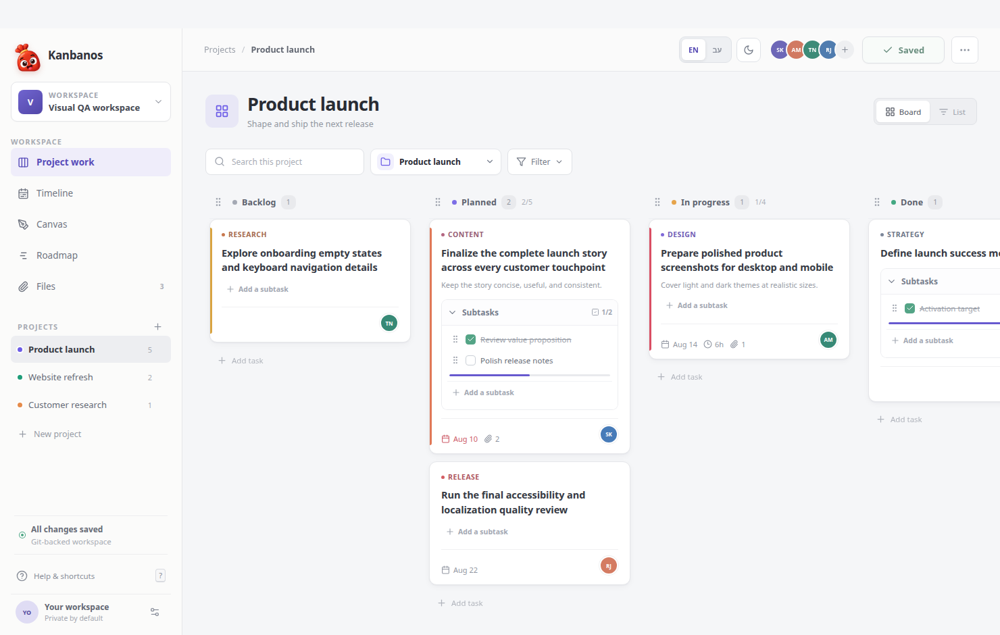
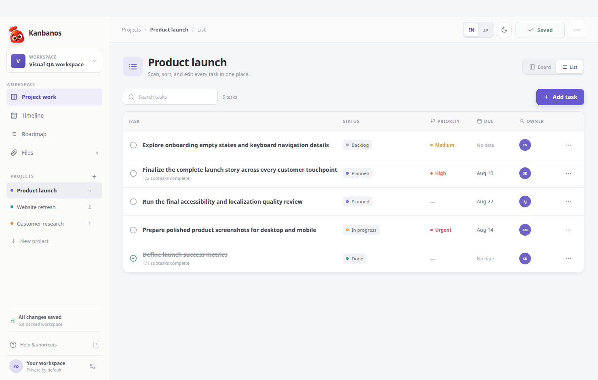
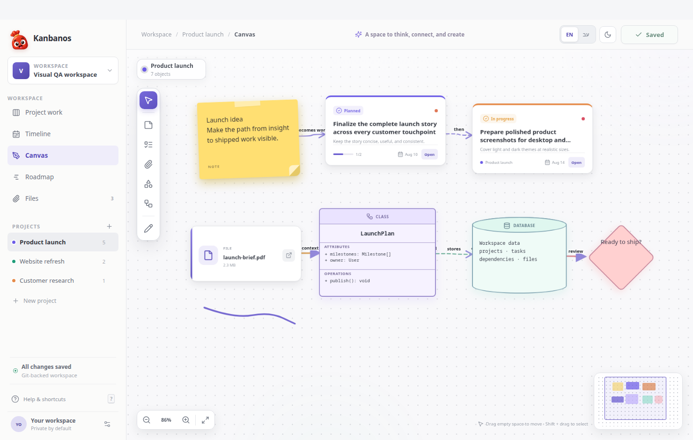
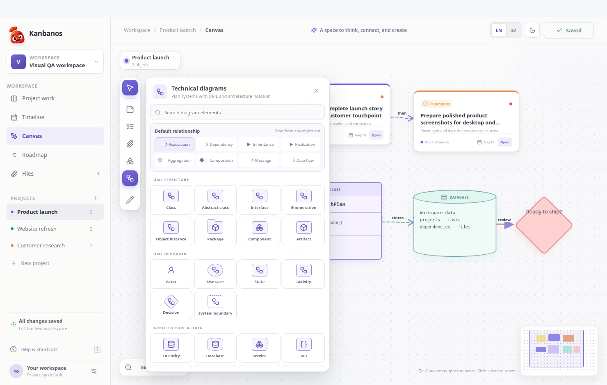
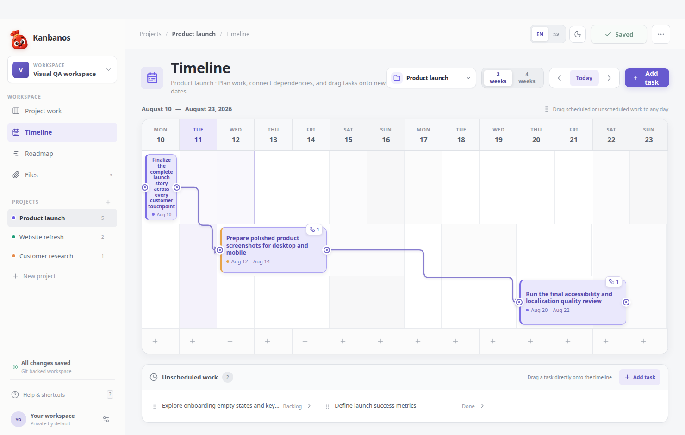
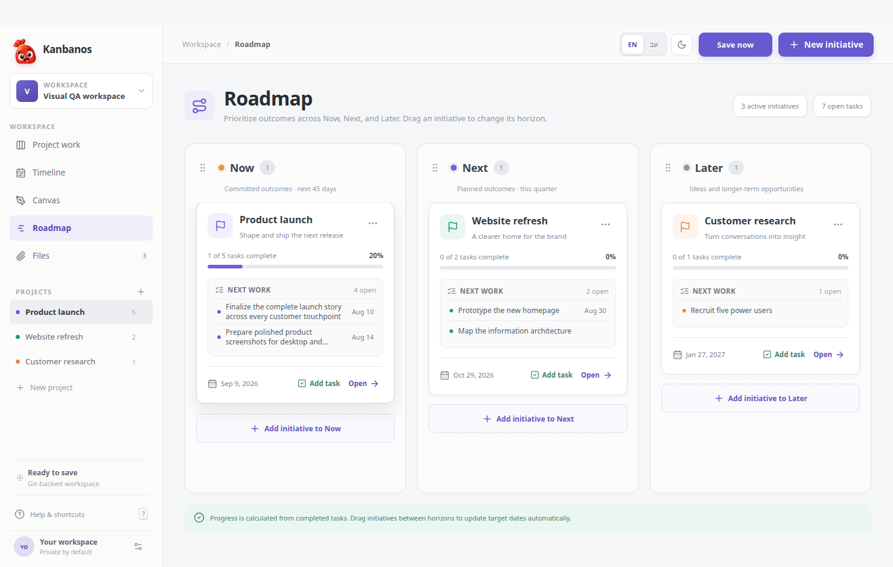
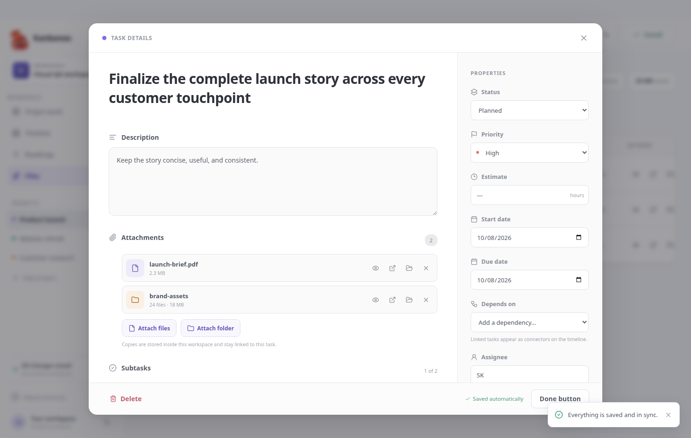
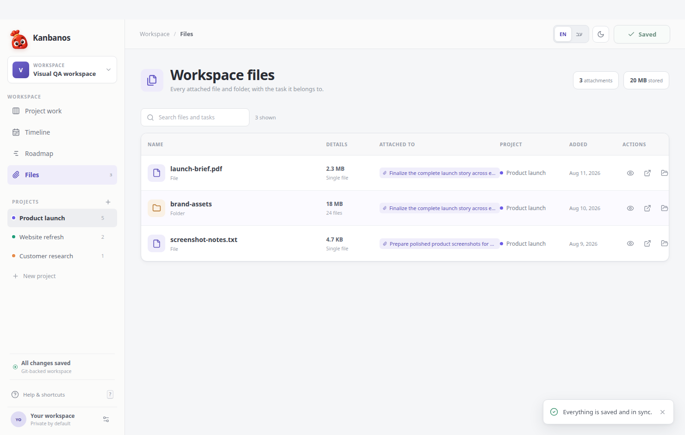
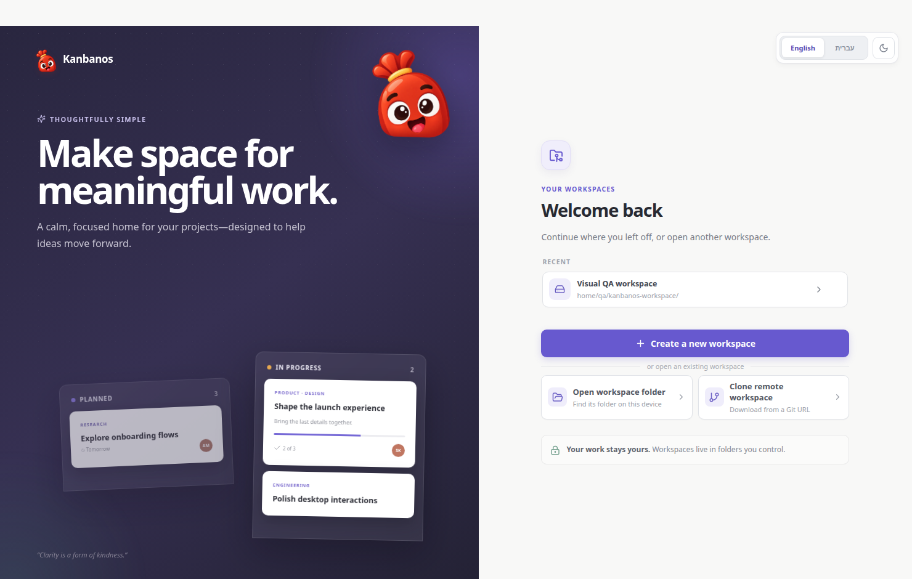

<p align="center"></p>

<h1 align="center">Kanbanos</h1>
<p align="center"><strong>A local-first task manager for planning work without giving up ownership of your data.</strong></p>

<p align="center">
  
  
  
  
  
  <a href="https://github.com/talamar49/kanbanos/actions/workflows/release.yml"></a>
  <a href="https://github.com/talamar49/kanbanos/releases/latest"></a>
</p>

Kanbanos is a **task manager first**: capture work, break it into subtasks, prioritize it, schedule it, and follow it from idea to done. Use a Kanban board for daily execution, a list for quick scanning, a visual canvas for connecting ideas and tasks, a dependency-aware timeline for scheduling, and a Now/Next/Later roadmap for higher-level planning.

Your tasks are not locked inside a hosted service. Every workspace is backed by a local Git repository. Desktop workspaces live in a folder you choose; mobile workspaces live in private app storage and can be exported as portable packages. The app handles Git in the background, so you get local history, offline access, and optional remote sync without needing to work from the command line.



## Task management features

| Feature | What it gives you |
| --- | --- |
| **Board and List views** | Drag tasks through customizable Kanban columns or scan, sort, and complete them in a focused list. |
| **Rich task details** | Add descriptions, labels, priorities, estimates, assignees, start/due dates, subtasks, dependencies, and file or folder attachments. |
| **Visual Canvas** | Arrange notes, live task cards, files, shapes, freehand drawings, and technical diagrams on an infinite project canvas. Connect objects with UML and data-flow relationships. |
| **Timeline planning** | Plan two or four weeks at a time, drag work onto dates, reschedule bars, and connect dependent tasks visually. |
| **Now / Next / Later roadmap** | Group projects into planning horizons, reorder initiatives, track progress, and see upcoming work. |
| **Files with task context** | Find every workspace attachment, see which task it belongs to, and preview common document, media, text, Markdown, and modern Office formats in the app. |
| **Fast daily workflow** | Capture tasks from every planning view, search across work, filter by priority, and keep flow under control with WIP limits. |
| **Native cross-platform experience** | Work on Windows, macOS, Linux, Android, or iOS in English or Hebrew RTL, with light and soft-dark themes and phone-friendly touch interactions. |

## App screens

### Board and List

<table>
  <tr>
    <td width="50%"></td>
    <td width="50%"></td>
  </tr>
  <tr>
    <td align="center"><strong>Board</strong> — move work from backlog to done.</td>
    <td align="center"><strong>List</strong> — scan and update every task in one place.</td>
  </tr>
</table>

### Visual Canvas



The Canvas turns a project into a flexible thinking space. Place live tasks beside notes and reference files, sketch freely, build flowcharts or UML-style technical diagrams, connect objects with named relationships, and navigate large plans with zoom controls and a minimap.

<details>
  <summary><strong>See the technical diagram library</strong></summary>
  <br />
  
</details>

### Timeline and Roadmap

<table>
  <tr>
    <td width="50%"></td>
    <td width="50%"></td>
  </tr>
  <tr>
    <td align="center"><strong>Timeline</strong> — schedule tasks and connect dependencies.</td>
    <td align="center"><strong>Roadmap</strong> — organize outcomes across Now, Next, and Later.</td>
  </tr>
</table>

### Task details and workspace files

<table>
  <tr>
    <td width="50%"></td>
    <td width="50%"></td>
  </tr>
  <tr>
    <td align="center"><strong>Task details</strong> — keep the work and its context together.</td>
    <td align="center"><strong>Files</strong> — find attachments by task and project.</td>
  </tr>
</table>

##  Every workspace is local Git

**A Kanbanos workspace is a real local Git repository under your control.** Desktop workspaces live in a folder you choose. Mobile workspaces live in private app storage and can be exported as a `.kanbanos.zip` package. A remote server and user account are not required.

- Creating a workspace initializes Git locally in your chosen desktop folder or private mobile app storage.
- Tasks, projects, planning data, and managed attachments remain available offline on your device.
- Saving creates local Git commits automatically, giving the workspace durable history.
- Connecting a remote is optional; when configured, Kanbanos fetches, merges, and pushes for you.
- Desktop can open an existing local Git repository; mobile can import a workspace package; both can clone a remote workspace.
- Desktop supports private HTTPS and SSH authentication. Mobile uses HTTPS tokens and converts common SSH-style remote URLs to HTTPS. Both provide human-friendly conflict resolution if versions diverge.



## Product principles

- **Tasks stay central** — every view helps capture, organize, schedule, or complete work.
- **Calm by default** — hierarchy, whitespace, and motion guide attention without visual noise.
- **Local and owned** — workspace data starts on your device in a repository you control.
- **Git without a Git UI** — useful Git operations happen automatically behind the task manager.
- **Safe conflict handling** — compare clear summaries and choose which version to keep when work diverges.
- **Module-ready** — shared projects and tasks remain independent from their placement in Board, Canvas, Timeline, and Roadmap views.

## Architecture

```text
electron/
  main.ts             Electron lifecycle and secure IPC
  preload.ts          Narrow renderer API bridge
  git-service.ts      Desktop repository, persistence, sync, and conflict handling
src/
  domain/             View-independent workspace model and reducer
  platform/           Mobile Git, secure storage, attachments, and runtime adapters
  components/         Responsive application shell, task, Canvas, and planning views
  styles/             Shared desktop/mobile visual design system
android/               Capacitor Android application
ios/                   Capacitor iOS application
```

Kanban placement is stored below `workItem.moduleData.kanban`, while visual project layouts live in `modules.canvas`. Project and work-item identity remain view-independent, so modules can add their own data without changing core entities.

## Development

Requirements: Node.js 22+ and Git installed on the machine. Android builds additionally require JDK 21 and Android SDK 36; the app supports Android 8.0/API 26 or newer. iOS builds require macOS and Xcode; the app supports iOS 15 or newer.

```bash
npm install
npm run dev
```

The Vite renderer opens inside Electron. A browser-only preview is also available through the Vite URL and uses in-memory demo data.

## Build

```bash
npm run build          # type-check and production web/Electron build
npm run dist:win       # Windows NSIS installer
npm run dist:mac       # universal macOS DMG (Intel and Apple silicon)
npm run dist:linux     # Linux AppImage and deb
npm run mobile:sync    # build and synchronize Android/iOS projects
npm run mobile:android # build an installable Android debug APK
npm run mobile:ios     # synchronize the Xcode project
```

Cross-compiling Windows installers from Linux may require Wine, while macOS and iOS builds must be created on macOS. Native platform builds are recommended for release artifacts. Every versioned push to `main` is built natively for Windows, macOS, Linux, Android, and iOS by GitHub Actions and published on the [Releases page](https://github.com/talamar49/kanbanos/releases). Android releases include an installable APK. iOS releases include a compiled Simulator app; physical-device and App Store distribution additionally require Apple signing credentials. See [MOBILE.md](MOBILE.md) for native development and signing details.

## Workspace storage

Kanbanos keeps its managed workspace data in an extensible directory:

```text
.kanbanos/
  .gitignore
  workspace.json
  credentials.json  # private-repo credentials, local-only
  content/
    attachments/
      <attachment-id>/
        <copied file or folder>
```

Attachment metadata and task links live in `workspace.json`. Attached content is copied into an ID-scoped directory so duplicate names cannot collide and future resource types can be added alongside `attachments`. Previews are generated locally: binary media is served through a path-validated Electron protocol, text is size-limited, and modern Office archives are read without uploading workspace content to an external service. Legacy binary Office formats such as `.doc`, `.ppt`, and `.xls` still open in their installed desktop application.

On desktop, private HTTPS credentials are stored in `.kanbanos/credentials.json`. The file is permission-restricted to the current user and excluded by `.kanbanos/.gitignore`, so it remains local to that workspace and is never committed. Credentials use Electron's system-backed encryption when available; systems without an available keyring use the restricted local file as a durable fallback. Mobile credentials are kept outside the repository in iOS Keychain or Android Keystore-backed encrypted storage.

On save Kanbanos commits the managed `.kanbanos` directory except ignored local files, fetches the remote, merges if needed, and pushes the active branch. If the network or remote is unavailable, the local Git commit remains safe and the UI clearly reports that sync needs attention.

## Mobile behavior

The Android and iOS apps retain the same workspace format, local commit behavior, attachment model, and Git conflict flow as desktop. Repositories are persisted offline in private WebView storage and flushed after Git operations. Native file pickers copy selected content into the workspace, previews stay on-device, and exports never include credentials. Mobile remotes use Git smart HTTP over HTTPS; common SSH-style URLs are converted to their HTTPS equivalent and private repositories authenticate with a token.

## Security

The Electron renderer is sandboxed and has no Node.js access. Filesystem, dialog, shell, and Git operations run in Electron's main process and are exposed through a small, typed preload bridge. Git commands are spawned with argument arrays rather than interpolated shell commands. Persisted private-repository credentials use Electron's secure storage when available and otherwise fall back to the permission-restricted, git-ignored workspace credential file. They are supplied to Git only for the matching operation and never embedded in the remote URL or repository configuration. Mobile credentials use iOS Keychain or Android Keystore, Android backup is disabled for private workspace data, cleartext network traffic is disabled, and mobile Git accepts only HTTPS remotes.

## License

MIT
